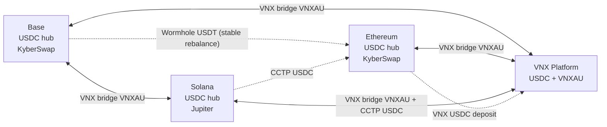

# VNXAU Menace — Executive Route Content

> **Purpose:** Structured source for executive route PDFs and stakeholder briefings.  
> **Source of truth:** `src/scanner/routes.py`, `config/chains.yaml`, `config/tokens.yaml`  
> **Repo:** [VNXAU_menace](https://github.com/Giansensey007/VNXAU_menace)  
> **Chains:** Base · Solana · Ethereum (hub) · VNX Platform — **no Celo**  
> **Token:** VNXAU · **Platform pair:** `VNXAU/USDC`

---

## Configuration snapshot

| Setting | Value |
|---|---|
| Directed arb routes | **8** |
| Treasury VNXAU home | Platform only (`platform_vnxau_only: true`) |
| Closed loop | After every arb (`close_loop_always_return: true`) |
| Trade size (deploy) | 0.4–5 VNXAU |
| Min profit | $5.00 round-trip |
| VNX platform order min | 0.4 VNXAU (`VNX_MIN_ORDER_VNXAU`) |
| VNX on-chain deposit min (BASE / SOL / ETH VNXAU) | 5 VNXAU cumulative |
| VNX ETH USDC deposit min | 20 USDC cumulative |
| `enable_vnx_arb_routes` | true (Base↔VNX + ETH↔VNX) |
| `enable_vnx_cctp_routes` | true (Sol↔VNX + CCTP return) |
| `indirect_route_premium_usd` | $5 (base↔sol vs SOL↔platform selection) |

---

## Chain inventory model

| Chain | Holds | Swap venue | Hub stable |
|---|---|---|---|
| **VNX Platform** | Idle VNXAU + USDC for `vnx_to_*` buys | VNX API | USDC |
| **Base** | USDC only (no idle VNXAU; dust ≤ 0.01 swept) | **KyberSwap** aggregator (`USE_KYBER_SWAP=true`) | USDC |
| **Solana** | USDC only | **Jupiter** | USDC |
| **Ethereum** | USDC hub buffer + gas (no idle VNXAU) | **KyberSwap** aggregator | USDC |

**VNX ETH rail:** platform credits **USDC only** on Ethereum (`VNX_ETH_DEPOSIT_ASSET`). No ETH-native VNXAU deposit path for treasury settlement.

---

## Token addresses

| Chain | VNXAU contract / mint |
|---|---|
| Base | `0xac3fe22294beaed9d1fd752323a6d06d12ff3098` |
| Ethereum | `0x6d57B2E05F26C26b549231c866bdd39779e4a488` |
| Solana | `9TPL8droGJ7jThsq4momaoz6uhTcvX2SeMqipoPmNa8R` |
| VNX Platform | `VNXAU` (symbol) |

| Chain | Hub stable (USDC) |
|---|---|
| Base | `0x833589fCD6eDb6E08f4c7C32D4F71b54bda02913` |
| Ethereum | `0xA0b86991c6218b36c1d19D4a2e9Eb0cE3606eB48` |
| Solana | `EPjFWdd5AufqSSqeM2qN1xzybapC8G4wEGGkZwyTDt1v` |

KyberSwap excludes limit-order sources on ETH (`KYBER_EXCLUDED_SOURCES=kyberswap-limit-order,kyberswap-limit-order-v2`) to avoid bad VNXAU/USDC fills.

---

## Topology



ASCII overview:

```
                    ┌─────────────┐
                    │ VNX Platform│
                    │ VNXAU + USDC│
                    └──────┬──────┘
           VNX VNXAU bridge │ VNX VNXAU bridge
      ┌────────────────────┼────────────────────┐
      │                    │                    │
┌─────▼─────┐      ┌───────▼───────┐    ┌──────▼──────┐
│   Base    │      │   Solana      │    │  Ethereum   │
│ USDC+Kyber│◄────►│ USDC+Jupiter  │    │ USDC+Kyber  │
└───────────┘ VNX  └───────┬───────┘    └──────┬──────┘
       ▲    VNXAU           │ CCTP USDC         │
       │                    └─────────┬─────────┘
       └──── Wormhole USDT (rebalance) ┘
```

---

## Route groups

| Group | Directions | Active when |
|---|---|---|
| `base_sol` | `base_to_solana`, `solana_to_base` | Always |
| `base_vnx` | `base_to_vnx`, `vnx_to_base` | `ENABLE_VNX_ARB_ROUTES=true` |
| `eth_vnx` | `ethereum_to_vnx`, `vnx_to_ethereum` | `ENABLE_VNX_ARB_ROUTES=true` |
| `vnx_sol` | `solana_to_vnx`, `vnx_to_solana` | `ENABLE_VNX_CCTP_ROUTES=true` |

---

## Directed arbitrage routes (8)

Buy VNXAU on **buy chain**, sell VNXAU on **sell chain**. Each route ends with hub stables on the **sell chain**.

---

### 1. `base_to_solana` (ACTIVE)

| Field | Value |
|---|---|
| Group | `base_sol` |
| Buy leg | Base |
| Sell leg | Solana |
| Ends on | Solana USDC |
| Inverse | `solana_to_base` |
| Closed-loop return | `solana_to_base` |

**Flow:** `Base USDC` → `VNXAU` → `VNXAU` → `Sol USDC`

| Step | Chain | In → Out | Mechanism |
|---|---|---|---|
| 1 | Base | USDC → VNXAU | KyberSwap aggregator |
| 2 | Base → Solana | VNXAU → VNXAU | **VNX** bridge (deposit BASE, withdraw SOL) |
| 3 | Solana | VNXAU → USDC | Jupiter |
| 4 (reconcile) | Sol → Base | USDT probe | **Wormhole** USDT rebalance (stables landed on Sol) |

```
Base USDC ──Kyber──► Base VNXAU ──VNX bridge──► Sol VNXAU ──Jupiter──► Sol USDC
                                                          └── Wormhole USDT probe ──► Base
```

**Minimums:** 5 VNXAU BASE deposit · 0.4 VNXAU platform · 0.4 VNXAU deploy

---

### 2. `solana_to_base` (ACTIVE)

| Field | Value |
|---|---|
| Group | `base_sol` |
| Buy leg | Solana |
| Sell leg | Base |
| Ends on | Base USDC |
| Inverse | `base_to_solana` |
| Closed-loop return | `base_to_solana` |

**Flow:** `Sol USDC` → `VNXAU` → `VNXAU` → `Base USDC`

| Step | Chain | In → Out | Mechanism |
|---|---|---|---|
| 1 | Solana | USDC → VNXAU | Jupiter |
| 2 | Solana → Base | VNXAU → VNXAU | **VNX** bridge (deposit SOL, withdraw BASE) |
| 3 | Base | VNXAU → USDC | KyberSwap aggregator |
| 4 (reconcile) | Base → Sol | USDT probe | **Wormhole** USDT rebalance (optional probe) |

```
Sol USDC ──Jupiter──► Sol VNXAU ──VNX bridge──► Base VNXAU ──Kyber──► Base USDC
```

**Minimums:** 5 VNXAU SOL deposit · 0.4 VNXAU platform · 0.4 VNXAU deploy

---

### 3. `base_to_vnx` (ACTIVE)

| Field | Value |
|---|---|
| Group | `base_vnx` |
| Buy leg | Base |
| Sell leg | VNX Platform |
| Ends on | VNX USDC |
| Inverse | `vnx_to_base` |
| Closed-loop return | `vnx_to_base` (+ hub `base_usdc_to_vnx_usdc` for USDC refill) |

**Flow:** `Base USDC` → `VNXAU` → platform `USDC`

| Step | Chain | In → Out | Mechanism |
|---|---|---|---|
| 1 | Base | USDC → VNXAU | KyberSwap aggregator |
| 2 | Base → VNX | VNXAU → platform VNXAU | **VNX** deposit-only (BASE) |
| 3 | VNX | VNXAU → USDC | VNX platform sell |

```
Base USDC ──Kyber──► Base VNXAU ──VNX deposit──► Platform VNXAU ──VNX sell──► Platform USDC
```

**Closed-loop USDC refill (auxiliary):** `base_usdc_to_vnx_usdc` — Base USDT → **Wormhole** → ETH USDT → Uniswap USDC → **VNX** ETH USDC deposit.

**Minimums:** 5 VNXAU BASE deposit · 0.4 VNXAU platform sell · 0.4 VNXAU deploy · 20 USDC for ETH hub deposit

---

### 4. `vnx_to_base` (ACTIVE)

| Field | Value |
|---|---|
| Group | `base_vnx` |
| Buy leg | VNX Platform |
| Sell leg | Base |
| Ends on | Base USDC |
| Inverse | `base_to_vnx` |
| Closed-loop return | `base_to_vnx` |

**Flow:** platform `USDC` → `VNXAU` → `Base USDC`

| Step | Chain | In → Out | Mechanism |
|---|---|---|---|
| 1 | VNX | USDC → VNXAU | VNX platform buy |
| 2 | VNX → Base | VNXAU → VNXAU | **VNX** withdraw-only (BASE) |
| 3 | Base | VNXAU → USDC | KyberSwap aggregator |

```
Platform USDC ──VNX buy──► Platform VNXAU ──VNX withdraw──► Base VNXAU ──Kyber──► Base USDC
```

**Minimums:** 0.4 VNXAU platform buy · 5 VNXAU withdraw credit · 0.4 VNXAU deploy

---

### 5. `ethereum_to_vnx` (ACTIVE)

| Field | Value |
|---|---|
| Group | `eth_vnx` |
| Buy leg | Ethereum |
| Sell leg | VNX Platform |
| Ends on | VNX USDC |
| Inverse | `vnx_to_ethereum` |
| Closed-loop return | `vnx_to_ethereum` |

**Flow:** `ETH USDC` → `VNXAU` → platform `USDC`

| Step | Chain | In → Out | Mechanism |
|---|---|---|---|
| 1 | Ethereum | USDC → VNXAU | KyberSwap aggregator (`0x6d57…a488`) |
| 2 | ETH → VNX | VNXAU → platform VNXAU | **VNX** deposit-only (ETH) |
| 3 | VNX | VNXAU → USDC | VNX platform sell |

```
ETH USDC ──Kyber──► ETH VNXAU ──VNX deposit──► Platform VNXAU ──VNX sell──► Platform USDC
```

**Minimums:** 5 VNXAU ETH deposit · 0.4 VNXAU platform sell · 0.4 VNXAU deploy

---

### 6. `vnx_to_ethereum` (ACTIVE)

| Field | Value |
|---|---|
| Group | `eth_vnx` |
| Buy leg | VNX Platform |
| Sell leg | Ethereum |
| Ends on | ETH USDC |
| Inverse | `ethereum_to_vnx` |
| Closed-loop return | `ethereum_to_vnx` |

**Flow:** platform `USDC` → `VNXAU` → `ETH USDC`

| Step | Chain | In → Out | Mechanism |
|---|---|---|---|
| 1 | VNX | USDC → VNXAU | VNX platform buy |
| 2 | VNX → ETH | VNXAU → VNXAU | **VNX** withdraw-only (ETH) |
| 3 | Ethereum | VNXAU → USDC | KyberSwap aggregator |

```
Platform USDC ──VNX buy──► Platform VNXAU ──VNX withdraw──► ETH VNXAU ──Kyber──► ETH USDC
```

**Minimums:** 0.4 VNXAU platform buy · 5 VNXAU withdraw credit · 0.4 VNXAU deploy

---

### 7. `solana_to_vnx` (ACTIVE)

| Field | Value |
|---|---|
| Group | `vnx_sol` |
| Buy leg | Solana |
| Sell leg | VNX Platform |
| Ends on | VNX USDC (Sol USDC on chain; CCTP moves surplus to ETH hub) |
| Inverse | `vnx_to_solana` |
| Closed-loop return | `vnx_to_solana` + `cctp_sol_usdc_to_vnx` |

**Flow:** `Sol USDC` → `VNXAU` → platform `USDC`

| Step | Chain | In → Out | Mechanism |
|---|---|---|---|
| 1 | Solana | USDC → VNXAU | Jupiter |
| 2 | Sol → VNX | VNXAU → platform VNXAU | **VNX** deposit-only (SOL) |
| 3 | VNX | VNXAU → USDC | VNX platform sell |
| 4 (reconcile) | ETH → Sol | USDC probe | **CCTP** USDC rebalance (`CCTP_RECONCILE_USDC`) |

```
Sol USDC ──Jupiter──► Sol VNXAU ──VNX deposit──► Platform VNXAU ──VNX sell──► Platform USDC
                                                              └── CCTP ETH→Sol probe
```

**Minimums:** 5 VNXAU SOL deposit · 0.4 VNXAU platform sell · 0.4 VNXAU deploy

---

### 8. `vnx_to_solana` (ACTIVE)

| Field | Value |
|---|---|
| Group | `vnx_sol` |
| Buy leg | VNX Platform |
| Sell leg | Solana |
| Ends on | Solana USDC |
| Inverse | `solana_to_vnx` |
| Closed-loop return | `solana_to_vnx` + `cctp_sol_usdc_to_vnx` |

**Flow:** platform `USDC` → `VNXAU` → `Sol USDC`

| Step | Chain | In → Out | Mechanism |
|---|---|---|---|
| 1 | VNX | USDC → VNXAU | VNX platform buy |
| 2 | VNX → Sol | VNXAU → VNXAU | **VNX** withdraw-only (SOL) |
| 3 | Solana | VNXAU → USDC | Jupiter |

```
Platform USDC ──VNX buy──► Platform VNXAU ──VNX withdraw──► Sol VNXAU ──Jupiter──► Sol USDC
```

**Full treasury return:** `cctp_sol_usdc_to_vnx` — Sol USDC → **CCTP** → ETH USDC → **VNX** deposit → platform VNXAU buy.

**Minimums:** 0.4 VNXAU platform buy · 5 VNXAU withdraw credit · 0.4 VNXAU deploy · 20 USDC ETH deposit on CCTP return

---

## Auxiliary path (not a directed pair)

### `cctp_sol_usdc_to_vnx`

| Field | Value |
|---|---|
| From → To | Solana → VNX Platform |
| Token flow | USDC → USDC → VNXAU |
| Purpose | Closed-loop treasury return after `vnx_to_solana` |

| Step | Chain | In → Out | Mechanism |
|---|---|---|---|
| 1 | Solana → Ethereum | USDC → USDC | **CCTP** (Circle) |
| 2 | Ethereum → VNX | USDC → platform USDC | **VNX** ETH USDC deposit |
| 3 | VNX | USDC → VNXAU | VNX platform buy |

```
Sol USDC ──CCTP──► ETH USDC ──VNX deposit──► Platform USDC ──VNX buy──► Platform VNXAU
```

**Minimums:** 20 USDC cumulative ETH deposit · 0.4 VNXAU platform buy

---

## Bridge & swap reference

| Mechanism | Used for |
|---|---|
| **VNX bridge** | VNXAU deposit/withdraw between platform ↔ Base / Sol / ETH |
| **KyberSwap** | EVM swaps on Base and Ethereum (USDC ↔ VNXAU) |
| **Jupiter** | Solana swaps (USDC ↔ VNXAU) |
| **Wormhole** | USDT stable rebalance Base ↔ ETH (base↔sol group; `base_usdc_to_vnx_usdc` hub) |
| **CCTP** | USDC Sol ↔ ETH (vnx_sol group + closed-loop return) |
| **VNX platform API** | VNXAU ↔ USDC on-platform |

---

## Route selection logic

Scanner evaluates four groups in parallel (`select_execution_route`):

1. **`base_sol`** — always on  
2. **`vnx_sol`** — when `ENABLE_VNX_CCTP_ROUTES`  
3. **`base_vnx`** — when `ENABLE_VNX_ARB_ROUTES`  
4. **`eth_vnx`** — when `ENABLE_VNX_ARB_ROUTES`

When both `base_sol` and `vnx_sol` qualify, the bot picks the better net profit only if the winner exceeds the loser by ≥ `indirect_route_premium_usd` ($5 default); otherwise it may defer to indirect composition.

---

## Operational notes

- **Shared VNX account:** GBP, VCHF, and VNXAU bots share one VNX API key — set `VNX_COLLISION_RETRY_MAX` / `VNX_COLLISION_BACKOFF_SEC`.
- **JIT withdraw:** `jit_withdraw: true` — platform VNXAU withdrawn on demand for `vnx_to_*` routes.
- **Dry run:** default `DRY_RUN=true` until validation matrix passes.
- **No Celo:** VNXAU Menace does not include Celo hub or CeloSwap legs (unlike GBP/VCHF).

---

## Related docs

- Workspace matrix: `environment/docs/ROUTES_MATRIX_VNXAU.md`
- Deep analysis: `docs/vnxau-menace-analysis.md`
- Compare all bots: `environment/docs/ROUTES_MATRIX_ALL.md`
